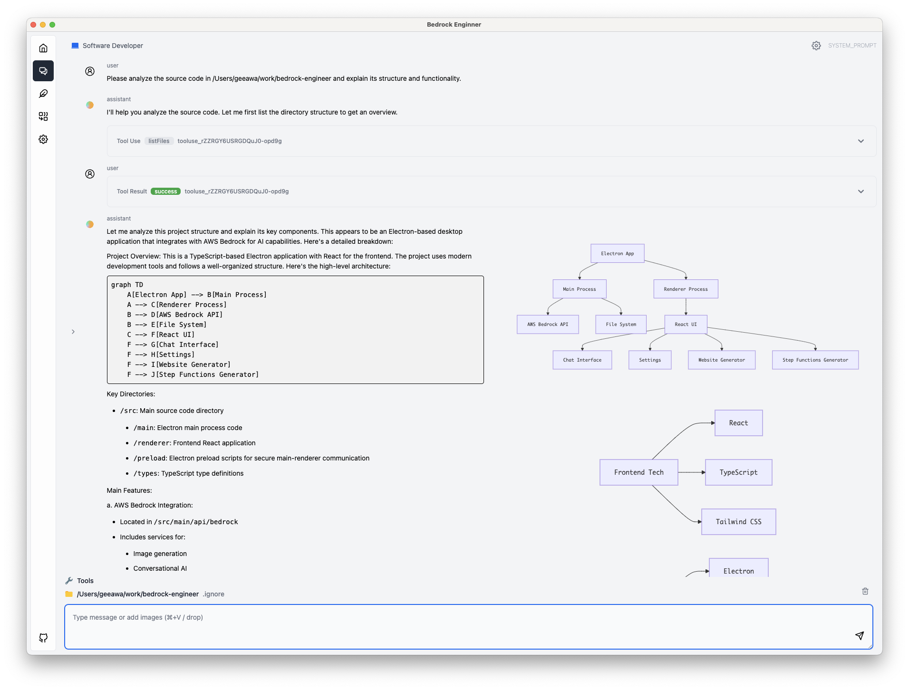
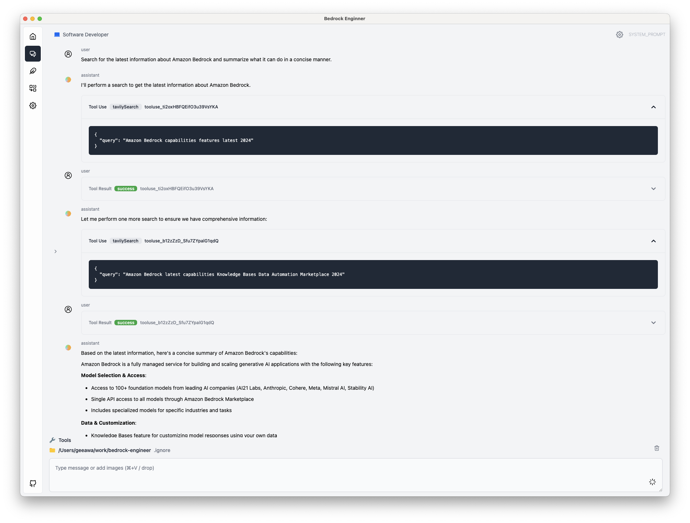
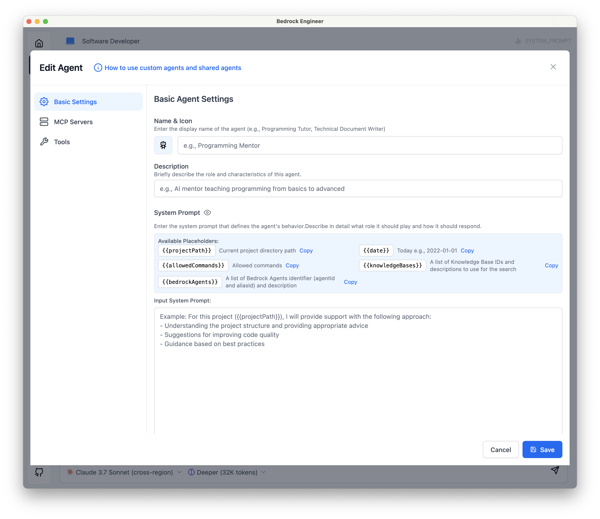
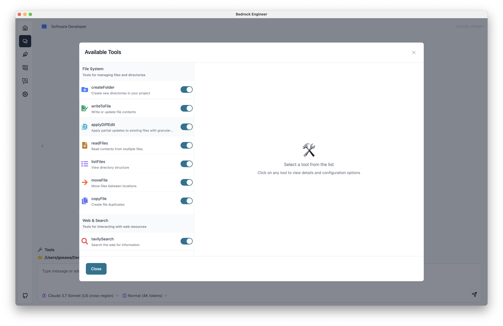
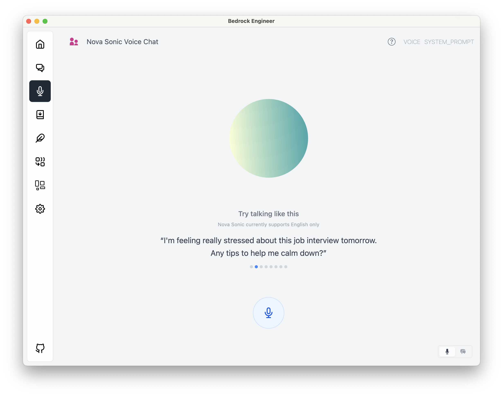
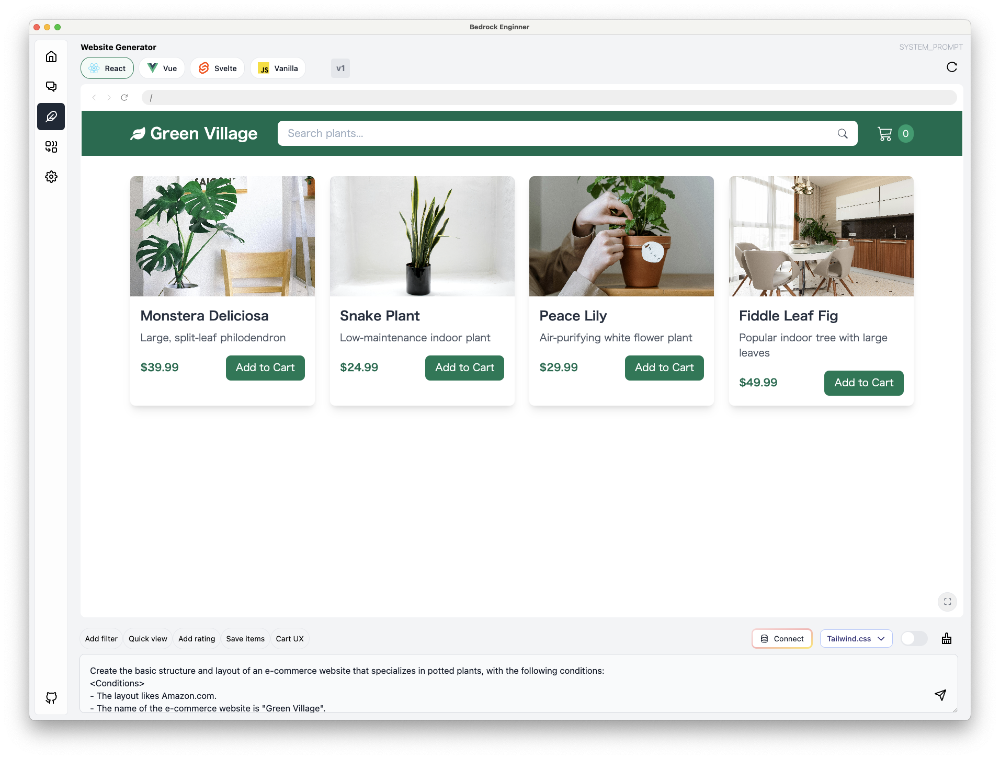
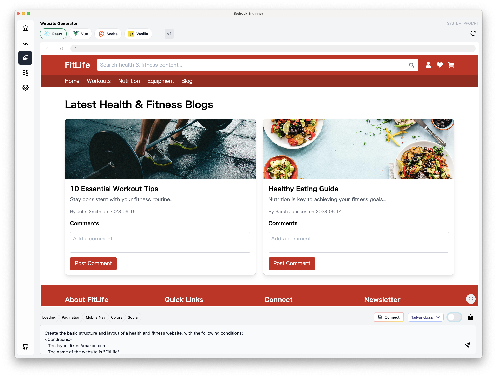
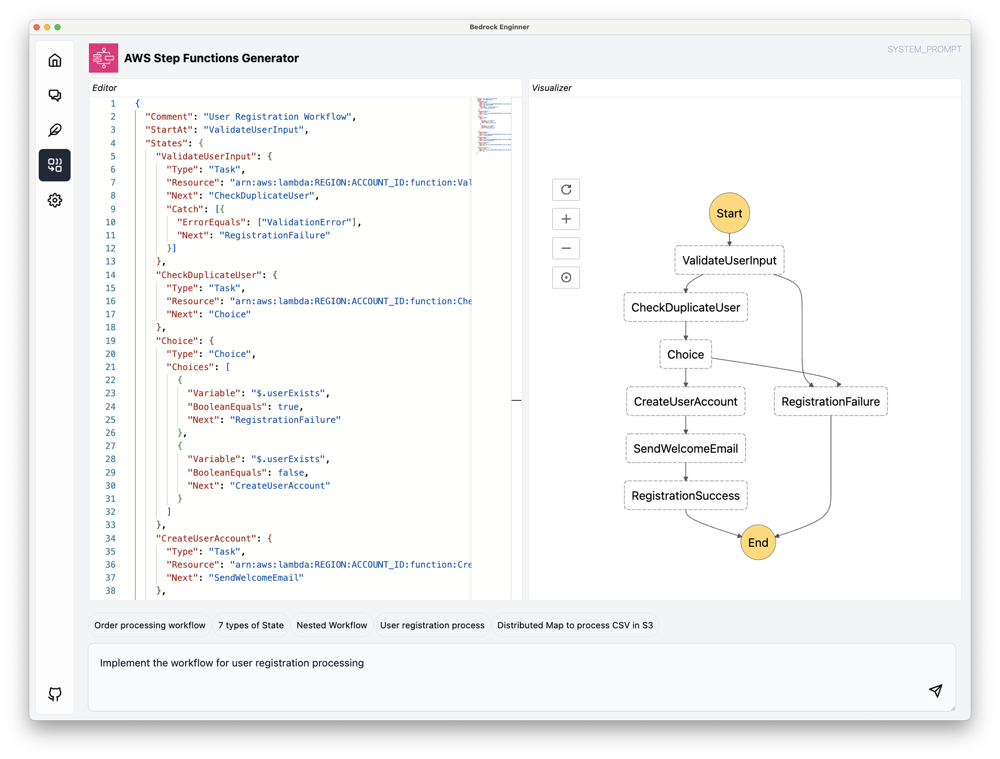

Language: [English](./README.md) / [Japanese](./README-ja.md)

> [!IMPORTANT]
> Starting with v1.6.0, it is now possible to set tools for each agent. Agent prompts created in versions prior to v1.6.0 can still be used, but please note that you will need to set the tools available to each agent.

# 🧙 Bedrock Engineer

Bedrock Engineer is Autonomous software development agent apps using [Amazon Bedrock](https://aws.amazon.com/bedrock/), capable of customize to create/edit files, execute commands, search the web, use knowledge base, use multi-agents, generative images and more.

## 💻 Demo

https://github.com/user-attachments/assets/f6ed028d-f3c3-4e2c-afff-de2dd9444759

## 🍎 Getting Started

Bedrock Engineer is a native app, you can download the app or build the source code to use it.

### Download

MacOS:

[](https://github.com/aws-samples/bedrock-engineer/releases/latest/download/bedrock-engineer-1.14.0.dmg)

[](https://github.com/aws-samples/bedrock-engineer/releases/latest/download/bedrock-engineer-1.14.0.pkg)

It is optimized for MacOS, but can also be built and used on Windows and Linux OS. If you have any problems, please report an issue.

<details>
<summary>Tips for Installation</summary>

### Installation

1. Download the latest release
2. Open the DMG file and drag the app to your Applications folder
3. Launch the app and configure your AWS credentials
4. Open System Preferences, click Security & Privacy, then put a checkmark to "Allow apps downloaded from anywhere" -> Click OK and enter your password

### Opening the Application

If you see "'Bedrock Engineer' can't be opened because Apple cannot check it for malicious software":

1. Open System Preferences
2. Click Privacy & Security
3. Scroll down and click "Open Anyway" next to "Bedrock Engineer was blocked to protect your Mac."

If a configuration file error occurs when starting the application, please check the following configuration files. If you cannot start the application even after deleting the configuration files and restarting it, please file an issue.

`/Users/{{username}}/Library/Application Support/bedrock-engineer/config.json`

</details>

### Build

First, install the npm modules:

```bash
npm install
```

Then, build application package

```bash
npm run build:mac
```

or

```bash
npm run build:win
```

or

```

npm run build:linux

```

Use the application stored in the `dist` directory.

## Agent Chat

The autonomous AI agent capable of development assists your development process. It provides functionality similar to AI assistants like [Cline](https://github.com/cline/cline), but with its own UI that doesn't depend on editors like VS Code. This enables richer diagramming and interactive experiences in Bedrock Engineer's agent chat feature. Additionally, with agent customization capabilities, you can utilize agents for use cases beyond development.

- 💬 Interactive chat interface with human-like Amazon Nova, Claude, and Meta llama models
- 📁 File system operations (create folders, files, read/write files)
- 🔍 Web search capabilities using Tavily API
- 🏗️ Project structure creation and management
- 🧐 Code analysis and improvement suggestions
- 📝 Code generation and execution
- 📊 Data analysis and visualization
- 💡 Agent customization and management
- 🛠️ Tool customization and management
- 🔄 Chat history management
- 🌐 Multi-language support
- 🛡️ Guardrail support
- 💡 Light processing model for cost optimization (v1.10.0+)

|  |  |
| :----------------------------------------------------: | :--------------------------------------------------: |
|             Code analysis and diagramming              |       Web search capabilities using Tavily API       |

### Select an Agent

Choose an agent from the menu in the top left. By default, it includes a Software Developer specialized in general software development, a Programming Mentor that assists with programming learning, and a Product Designer that supports the conceptual stage of services and products.


### Customize Agents

Enter the agent's name, description, and system prompt. The system prompt is a crucial element that determines the agent's behavior. By clearly defining the agent's purpose, regulations, role, and when to use available tools, you can obtain more appropriate responses.



### Select Tools / Customize Tools

Click the Tools icon in the bottom left to select the tools available to the agent. Tools can be configured separately for each agent.



The supported tools are:

#### 📂 File System Operations

| Tool Name      | Description                                                                                                                                                                   |
| -------------- | ----------------------------------------------------------------------------------------------------------------------------------------------------------------------------- |
| `createFolder` | Creates a new directory within the project structure. Creates a new folder at the specified path.                                                                             |
| `writeToFile`  | Writes content to a file. Creates a new file if it doesn't exist or updates content if the file exists.                                                                       |
| `readFiles`    | Reads contents from multiple files simultaneously. Supports text files and Excel files (.xlsx, .xls), automatically converting Excel files to CSV format.                     |
| `listFiles`    | Displays directory structure in a hierarchical format. Provides comprehensive project structure including all subdirectories and files, following configured ignore patterns. |
| `moveFile`     | Moves a file to a different location. Used for organizing files within the project structure.                                                                                 |
| `copyFile`     | Duplicates a file to a different location. Used when file duplication is needed within the project structure.                                                                 |

#### 🌐 Web & Search Operations

| Tool Name      | Description                                                                                                                                                                                                                                                                                     |
| -------------- | ----------------------------------------------------------------------------------------------------------------------------------------------------------------------------------------------------------------------------------------------------------------------------------------------- |
| `tavilySearch` | Performs web searches using the Tavily API. Used when current information or additional context is needed. Requires an API key.                                                                                                                                                                 |
| `fetchWebsite` | Retrieves content from specified URLs. Large content is automatically split into manageable chunks. Initial call provides chunk overview, with specific chunks retrievable as needed. Supports GET, POST, PUT, DELETE, PATCH, HEAD, OPTIONS methods with custom headers and body configuration. |

#### 🤖 Amazon Bedrock Integration

| Tool Name            | Description                                                                                                                                                                                                                                                                                                                                                                                                  |
| -------------------- | ------------------------------------------------------------------------------------------------------------------------------------------------------------------------------------------------------------------------------------------------------------------------------------------------------------------------------------------------------------------------------------------------------------ |
| `generateImage`      | Generates images using Amazon Bedrock LLMs. Uses stability.sd3-5-large-v1:0 by default and supports both Stability.ai and Amazon models. Supports specific aspect ratios and sizes for Titan models, with PNG, JPEG, and WebP output formats. Allows seed specification for deterministic generation and negative prompts for exclusion elements.                                                            |
| `recognizeImage`     | Analyzes images using Amazon Bedrock's image recognition capabilities. Supports various analysis types including object detection, text detection, scene understanding, and image captioning. Can process images from local files. Provides detailed analysis results that can be used for content moderation, accessibility features, automated tagging, and visual search applications.                    |
| `generateVideo`      | Generates videos using Amazon Nova Reel. Creates realistic, studio-quality videos from text prompts or images. Supports TEXT_VIDEO (6 seconds), MULTI_SHOT_AUTOMATED (12-120 seconds), and MULTI_SHOT_MANUAL modes. Returns immediately with job ARN for status tracking. Requires S3 configuration.                                                                                                         |
| `checkVideoStatus`   | Checks the status of video generation jobs using invocation ARN. Returns current status, completion time, and S3 location when completed. Use this to monitor progress of video generation jobs.                                                                                                                                                                                                             |
| `downloadVideo`      | Downloads completed videos from S3 using invocation ARN. Automatically retrieves S3 location from job status and downloads to specified local path or project directory. Only use when checkVideoStatus shows status as "Completed".                                                                                                                                                                         |
| `retrieve`           | Searches information using Amazon Bedrock Knowledge Base. Retrieves relevant information from specified knowledge bases.                                                                                                                                                                                                                                                                                     |
| `invokeBedrockAgent` | Interacts with specified Amazon Bedrock Agents. Initiates dialogue using agent ID and alias ID, with session ID for conversation continuity. Provides file analysis capabilities for various use cases including Python code analysis and chat functionality.                                                                                                                                                |
| `invokeFlow`         | Executes Amazon Bedrock Flows for custom data processing pipelines. Supports agent-specific flow configurations and multiple input data types (string, number, boolean, object, array). Enables automation of complex workflows and customized data processing sequences with flexible input/output handling. Ideal for data transformation, multi-step processing, and integration with other AWS services. |

#### 💻 System Command & Code Execution

| Tool Name         | Description                                                                                                                                                                                                                                                                                                                                                                                                                                                                                                                      |
| ----------------- | -------------------------------------------------------------------------------------------------------------------------------------------------------------------------------------------------------------------------------------------------------------------------------------------------------------------------------------------------------------------------------------------------------------------------------------------------------------------------------------------------------------------------------- |
| `executeCommand`  | Manages command execution and process input handling. Features two operational modes: 1) initiating new processes with command and working directory specification, 2) sending standard input to existing processes using process ID. For security reasons, only allowed commands can be executed, using the configured shell. Unregistered commands cannot be executed. The agent's capabilities can be extended by registering commands that connect to databases, execute APIs, or invoke other AI agents.                    |
| `codeInterpreter` | Executes Python code in a secure Docker environment with pre-installed data science libraries. Provides isolated code execution with no internet access for security. Supports two environments: "basic" (numpy, pandas, matplotlib, requests) and "datascience" (full ML stack including scikit-learn, scipy, seaborn, etc.). Input files can be mounted read-only at /data/ directory for analysis. Generated files are automatically detected and reported. Perfect for data analysis, visualization, and ML experimentation. |
| `screenCapture`   | Captures the current screen and saves as PNG image file. Optionally analyzes the captured image with AI using vision models (Claude/Nova) to extract text content, identify UI elements, and provide detailed visual descriptions for debugging and documentation purposes. Platform-specific permissions required (macOS: Screen Recording permission in System Preferences required).                                                                                                                                          |

<details>
<summary>Tips for Integrate Bedrock Agents</summary>

### Agent Preparation Toolkit (APT)

You can get up and running quickly with Amazon Bedrock Agents by using the [Agent Preparation Toolkit](https://github.com/aws-samples/agent-preparation-toolkit).

</details>

### MCP (Model Context Protocol) Client Integration

Model Context Protocol (MCP) client integration allows Bedrock Engineer to connect to external MCP servers and dynamically load and use powerful external tools. This integration extends the capabilities of your AI assistant by allowing it to access and utilize the tools provided by the MCP server.

## Agent Directory

The Agent Directory is a content hub where you can discover and immediately use AI agents created by skilled contributors. It offers a curated collection of pre-configured agents designed for various tasks and specialties.


### Features

- **Browse the Collection** - Explore a growing library of specialized agents created by the community
- **Search & Filter** - Quickly find agents using the search function or filter by tags to discover agents that match your needs
- **Detailed Information** - View comprehensive information about each agent including author, system prompt, supported tools, and usage scenarios
- **One-Click Addition** - Add any agent to your personal collection with a single click and start using it immediately
- **Contribute Your Agents** - Share your custom agents with the community by becoming a contributor

### Using the Agent Directory

1. **Browse and Search** - Use the search bar to find specific agents or browse the entire collection
2. **Filter by Tags** - Click on tags to filter agents by categories, specialties, or capabilities
3. **View Details** - Select any agent to view its complete system prompt, supported tools, and usage scenarios
4. **Add to Your Collection** - Click "Add to My Agents" to add the agent to your personal collection

### Contribute Your Agents

Become a contributor and share your custom agents with the community:

1. Export your custom agent as a shared file
2. Add your GitHub username as the author
3. Submit your agent via Pull Request or GitHub Issue

By contributing to the Agent Directory, you help build a valuable resource of specialized AI agents that enhance the capabilities of Bedrock Engineer for everyone.

## Nova Sonic Voice Chat

Real-time voice conversation feature powered by Amazon Nova Sonic. Engage in natural voice interactions with AI agents.



### Key Features

- 🎤 **Real-time Voice Input**: Natural conversation with AI using your microphone
- 🗣️ **Multiple Voice Selection**: Choose from 3 voice characteristics
  - Tiffany: Warm and friendly
  - Amy: Calm and composed
  - Matthew: Confident and authoritative
- 🤖 **Agent Customization**: Custom agents available just like Agent Chat
- 🛠️ **Tool Execution**: Agents can execute tools during voice conversations
- 🌐 **Multi-language Support**: Currently supports English only, with plans for other languages

Nova Sonic Voice Chat provides a more natural and intuitive AI interaction experience, different from traditional text-based exchanges. Voice communication enables efficient and approachable AI assistant experiences.

### Resolving Duplicate Permission Dialogs

If you experience duplicate OS permission dialogs (such as microphone access), you can resolve this issue by running the following command after building and installing the application to add an ad-hoc signature:

```bash
sudo codesign --force --deep --sign - "/Applications/Bedrock Engineer.app"
```

This command applies an ad-hoc code signature to the application, which helps prevent duplicate system permission dialogs.

## Website Generator

Generate and preview website source code in real-time. Currently supports the following libraries, and you can interactively generate code by providing additional instructions:

- React.js (w/ Typescript)
- Vue.js (w/ Typescript)
- Svelte.js
- Vanilla.js

Here are examples of screens generated by the Website Generator:

|  |  |  |
| :--------------------------------------------: | :--------------------------------------------------------------------: | :------------------------------------------------------------------: |
|          House Plant E-commerce Site           |                           Data Visualization                           |                           Healthcare Blog                            |

The following styles are also supported as presets:

- Inline styling
- Tailwind.css
- Material UI (React mode only)

### Agentic-RAG (Connect to Design System Data Source)

By connecting to Amazon Bedrock's Knowledge Base, you can generate websites referencing any design system, project source code, or website styles.

You need to store source code and crawled web pages in the knowledge base in advance. When registering source code in the knowledge base, it is recommended to convert it into a format that LLM can easily understand using methods such as [gpt-repository-loader](https://github.com/mpoon/gpt-repository-loader). Figma design files can be referenced by registering HTML and CSS exported versions to the Knowledge Base.

Click the "Connect" button at the bottom of the screen and enter your knowledge base ID.

### Web Search Agent

Website Generator integrates a code generation agent that utilizes web search capabilities. This feature allows you to generate more sophisticated websites by referencing the latest library information, design trends, and coding best practices. To use the search functionality, click the "Search" button at the bottom of the screen to enable it.

## Step Functions Generator

Generate AWS Step Functions ASL definitions and preview them in real-time.



## Diagram Generator

Create AWS architecture diagrams with ease using natural language descriptions. The Diagram Generator leverages Amazon Bedrock's powerful language models to convert your text descriptions into professional AWS architecture diagrams.

Key features:

- 🏗️ Generate AWS architecture diagrams from natural language descriptions
- 🔍 Web search integration to gather up-to-date information for accurate diagrams
- 💾 Save diagram history for easy reference and iteration
- 🔄 Get intelligent recommendations for diagram improvements
- 🎨 Professional diagram styling using AWS architecture icons
- 🌐 Multi-language support

The diagrams are created using draw.io compatible XML format, allowing for further editing and customization if needed.


## Star History

[](https://star-history.com/#aws-samples/bedrock-engineer&Date)

## Security

See [CONTRIBUTING](CONTRIBUTING.md#security-issue-notifications) for more information.

## License

This library is licensed under the MIT-0 License. See the LICENSE file.

This software uses [Lottie Files](https://lottiefiles.com/free-animation/robot-futuristic-ai-animated-xyiArJ2DEF).
